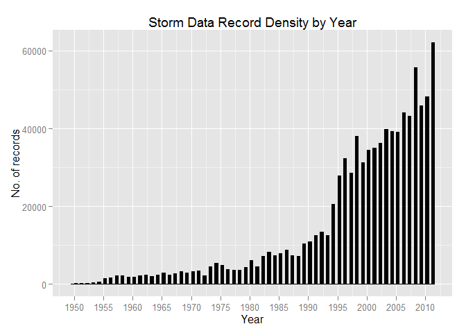
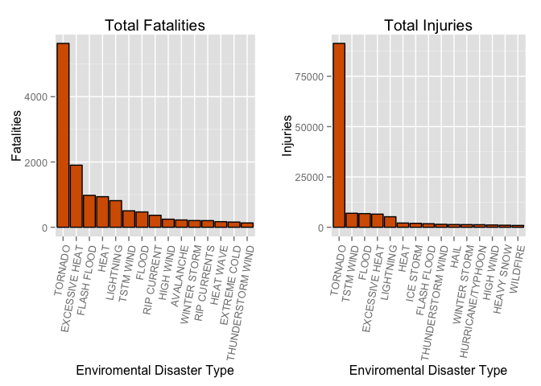
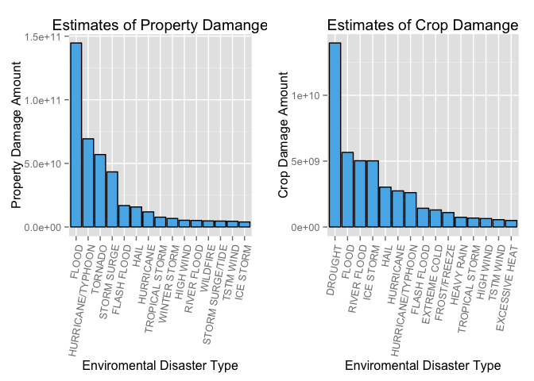

# Reproducible Research: Peer Assessment 2

### Introduction
Storms and other severe weather events can cause both public health and economic problems for communities and municipalities. Many severe events can result in fatalities, injuries, and property damage, and preventing such outcomes to the extent possible is a key concern. This project involves exploring the U.S. National Oceanic and Atmospheric Administration's (NOAA) storm database. This database tracks characteristics of major storms and weather events in the United States, including when and where they occur, as well as estimates of any fatalities, injuries, and property damage.


#### Settings

```r
knitr::opts_chunk$set(cache=TRUE)
setwd("/Users/Ryan/Dropbox/IDA MOOC Course/Course Workspace/ReproducibleResearch/workspace/PeerAssessment2")
echo = TRUE
library(knitr)
library(ggplot2)
```

```
## Warning: package 'ggplot2' was built under R version 3.1.3
```

```r
library(plyr)
require(gridExtra)
```

```
## Loading required package: gridExtra
## Loading required package: grid
```


#### Download and Unzip data
First to download the raw data, unzip it with the bzfile() function and load it into the raw_data variable as a data.frame object

```r
if(!file.exists("StormData.csv.bz2")){
  download.file(url="http://d396qusza40orc.cloudfront.net/repdata%2Fdata%2FStormData.csv.bz2", destfile="StormData.csv.bz2")
}

raw_data <- read.csv(bzfile("StormData.csv.bz2"))
dim(raw_data)
```

```
## [1] 902297     37
```

```r
head(raw_data, 3)
```

```
##   STATE__          BGN_DATE BGN_TIME TIME_ZONE COUNTY COUNTYNAME STATE
## 1       1 4/18/1950 0:00:00     0130       CST     97     MOBILE    AL
## 2       1 4/18/1950 0:00:00     0145       CST      3    BALDWIN    AL
## 3       1 2/20/1951 0:00:00     1600       CST     57    FAYETTE    AL
##    EVTYPE BGN_RANGE BGN_AZI BGN_LOCATI END_DATE END_TIME COUNTY_END
## 1 TORNADO         0                                               0
## 2 TORNADO         0                                               0
## 3 TORNADO         0                                               0
##   COUNTYENDN END_RANGE END_AZI END_LOCATI LENGTH WIDTH F MAG FATALITIES
## 1         NA         0                      14.0   100 3   0          0
## 2         NA         0                       2.0   150 2   0          0
## 3         NA         0                       0.1   123 2   0          0
##   INJURIES PROPDMG PROPDMGEXP CROPDMG CROPDMGEXP WFO STATEOFFIC ZONENAMES
## 1       15    25.0          K       0                                    
## 2        0     2.5          K       0                                    
## 3        2    25.0          K       0                                    
##   LATITUDE LONGITUDE LATITUDE_E LONGITUDE_ REMARKS REFNUM
## 1     3040      8812       3051       8806              1
## 2     3042      8755          0          0              2
## 3     3340      8742          0          0              3
```
As we look at the raw data, it shows the it has 902297 rows and 37 variables.

##### Exploring the data
Peak into the data firstly by formating the BGN_DATE into a numeric YEAR format, this follows by plotting it as a histogram with the ggplot2 package.

```r
raw_data$year <- as.numeric(format(as.Date(raw_data$BGN_DATE, format='%m/%d/%Y %H:%M:%S'), '%Y'))
ggplot(raw_data, aes(x=year)) + labs(title="Storm Data Record Density by Year", x="Year",y="No. of records") + geom_histogram(binwidth=0.5, color="black", fill="black") + scale_x_continuous(breaks = seq(from=1950, to=2015, by=5))
```

 

##### Cleaning Data
Here we clean the data to subset variables that are relavant to the questions of Health and Economy.


```r
clean_data <- raw_data[,c("EVTYPE","FATALITIES","INJURIES","PROPDMG","PROPDMGEXP","CROPDMG","CROPDMGEXP")]
head(clean_data)
```

```
##    EVTYPE FATALITIES INJURIES PROPDMG PROPDMGEXP CROPDMG CROPDMGEXP
## 1 TORNADO          0       15    25.0          K       0           
## 2 TORNADO          0        0     2.5          K       0           
## 3 TORNADO          0        2    25.0          K       0           
## 4 TORNADO          0        2     2.5          K       0           
## 5 TORNADO          0        2     2.5          K       0           
## 6 TORNADO          0        6     2.5          K       0
```

As the questions are based on finding which EVTYPE has the greater impact, sort function is implemented to aggregate base on EVTYPE

```r
sorter <- function(fieldName, dataset=clean_data, head_n=20){
  index <- which(colnames(dataset) == fieldName)
  field <- aggregate(dataset[,index], by=list(dataset$EVTYPE), FUN = "sum")
  field <- arrange(field, field[,2], decreasing = TRUE)
  field <- head(field, head_n)
  colnames(field) <- c('EVTYPE','N')
  field <- within(field, EVTYPE <- factor(x = EVTYPE, levels = field$EVTYPE))
  return(field)
}
```

Taking into account the convertion of CROP and PROP damage exponent (H hundreds, K thousands, M millions, B billions).

```r
unique(clean_data$PROPDMGEXP)
```

```
##  [1] K M   B m + 0 5 6 ? 4 2 3 h 7 H - 1 8
## Levels:  - ? + 0 1 2 3 4 5 6 7 8 B h H K m M
```

```r
unique(clean_data$CROPDMGEXP)
```

```
## [1]   M K m B ? 0 k 2
## Levels:  ? 0 2 B k K m M
```

```r
convert <- function(fieldName, dataset=clean_data){
  index <- which(colnames(dataset) == fieldName)
  dataset[, index] <- as.character(dataset[, index])
  
  dataset[toupper(dataset[, index]) == "B", index] <- "9"
  dataset[toupper(dataset[, index]) == "M", index] <- "6"
  dataset[toupper(dataset[, index]) == "K", index] <- "3"
  dataset[toupper(dataset[, index]) == "H", index] <- "2"
  dataset[dataset[, index] == "", index] <- "0"
  
  #NAs are introduced in this
  dataset[, index] <- as.numeric(dataset[, index])
  dataset[is.na(dataset[,index]),index] <- 0
  return(dataset)
}
```

### Question 1 - EVTYPE Impact on Population Health?

Using the helper functions above, variables which impact on health are mainly the mortality and injury rates that their totals for every environment/disaster. Thus using the variables of FATALITIES and INJURIES from the dataset


```r
fatalities <- sorter("FATALITIES", dataset=clean_data, head_n=15)
injuries <- sorter("INJURIES", dataset=clean_data, head_n=15)

fatalitiesPlot <- qplot(EVTYPE, data=fatalities, geom="bar", weight=N) + geom_bar(color="black", fill="#D55E00") + ylab("Fatalities") + xlab("Enviromental Disaster Type") + ggtitle("Total Fatalities") + theme(axis.text.x = element_text(angle=80, hjust=1))

injuriesPlot <- qplot(EVTYPE, data=injuries, geom="bar", weight=N) + ylab("Injuries") + geom_bar(color="black", fill="#D55E00") + xlab("Enviromental Disaster Type") + ggtitle("Total Injuries") + theme(axis.text.x = element_text(angle=80, hjust=1))

#side by side grid plot
grid.arrange(fatalitiesPlot, injuriesPlot, ncol=2)
```

 

Base on the bar plots, **TORNADOES** are the largest contributer in terms of fatalities and injuries to the United States in 1950 onwards.


### Question 2 - EVTYPE Impact on Population Economy?

For economical analysis, the variables of PROPDMG & CROPDMG are used along with their exponents PROPDMGEXP & CROPDMGEXP are used to measure. Data transformation is required for the exponent (DMGEXP) to be multiplied (e.g 10^n) to the base number (DMG) to get the actual estimate of cost incured. Secondly, conversion of the exponent figures was made with the convert helper function.


```r
suppressWarnings(property <- convert(fieldName="PROPDMGEXP", dataset=clean_data))
suppressWarnings(crop <- convert(fieldName="CROPDMGEXP", dataset=clean_data))

property$PROPDMG <- property$PROPDMG * 10^property$PROPDMGEXP
crop$CROPDMG <- crop$CROPDMG * 10^crop$CROPDMGEXP

property <- sorter("PROPDMG", dataset=property, head_n=15)
crop <- sorter("CROPDMG", dataset=crop, head_n=15)

propertyPlot <- qplot(EVTYPE, data=property, geom="bar", weight=N) + geom_bar(color="black", fill="#56B4E9") + ylab("Property Damage Amount") + xlab("Enviromental Disaster Type") + ggtitle("Estimates of Property Damange") + theme(axis.text.x = element_text(angle=80, hjust=1))

cropPlot <- qplot(EVTYPE, data=crop, geom="bar", weight=N) + geom_bar(color="black", fill="#56B4E9") +  ylab("Crop Damage Amount") + xlab("Enviromental Disaster Type") + ggtitle("Estimates of Crop Damange") + theme(axis.text.x = element_text(angle=80, hjust=1))

grid.arrange(propertyPlot, cropPlot, ncol=2)
```

 

As shown from the above plots **Floods** and **Hurricane/Typhoon** have caused the largest property damage and came in second for crop damange. while **Drought** is the largest in crop damage. Another to take note is the **Hurricane/Typhoon** which is second for property and is top 10 for crop damage. Comparing exponents, **Floods** and **Hurricane/Typhoon** would have the largest cost impact for the economy.

